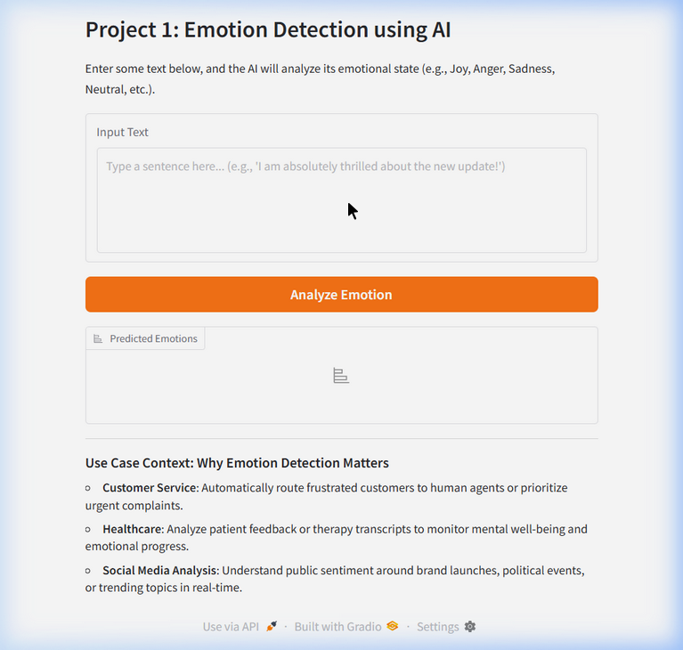
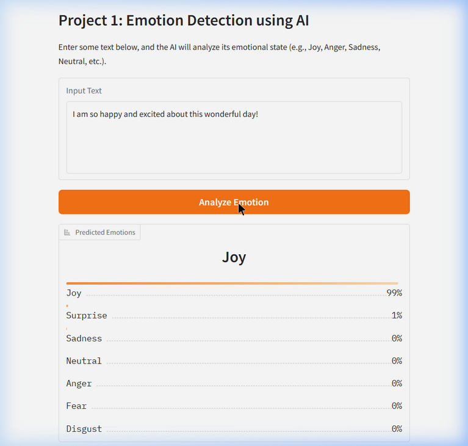
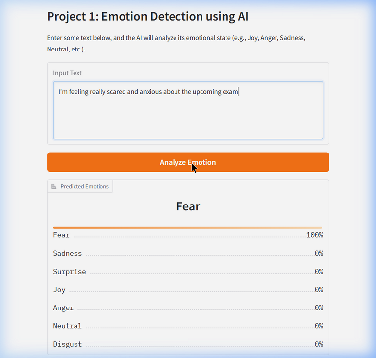

# 🎭 Emotion Detection using AI

An end-to-end machine learning system that classifies emotional states from text using **Hugging Face Transformers** and a **Gradio** web interface.

The system detects **7 emotions**: Joy, Sadness, Anger, Fear, Surprise, Disgust, and Neutral.

---

## 📸 Screenshots

### App Overview


### Result — Joy Detection (99% Confidence)


### Result — Fear Detection (100% Confidence)


---

## 🚀 Features

- **Real-time Emotion Classification** — Analyze text and get emotion predictions with confidence scores
- **7 Emotion Classes** — Joy, Sadness, Anger, Fear, Surprise, Disgust, Neutral
- **Pre-trained Model** — Uses `j-hartmann/emotion-english-distilroberta-base` (DistilRoBERTa fine-tuned on emotion data)
- **Fine-tuning Script** — Includes a training script to fine-tune `distilbert-base-uncased` on the `dair-ai/emotion` dataset
- **Interactive Gradio UI** — User-friendly web interface with live predictions

---

## 🛠️ Tech Stack

| Technology | Purpose |
|-----------|---------|
| Python 3.10+ | Core language |
| Hugging Face Transformers | Pre-trained NLP models & pipelines |
| Gradio | Interactive web UI |
| PyTorch | Deep learning framework |
| Datasets (HF) | Dataset loading & processing |
| Evaluate (HF) | Model evaluation metrics |

---

## 📦 Installation

### 1. Clone the repository

```bash
git clone https://github.com/hadeedzahid/emotion-detection-ai.git
cd emotion-detection-ai
```

### 2. Create a virtual environment (recommended)

```bash
python -m venv venv
# Windows
venv\Scripts\activate
# macOS/Linux
source venv/bin/activate
```

### 3. Install dependencies

```bash
pip install -r requirements.txt
```

---

## ▶️ Usage

### Run the Gradio App (Inference)

```bash
python app.py
```

The app will start at **http://127.0.0.1:7860**. Open it in your browser, type any text, and click **"Analyze Emotion"** to see the predicted emotions with confidence scores.

### Fine-tune the Model (Training)

```bash
python train.py
```

This script:
- Loads the `dair-ai/emotion` dataset from Hugging Face
- Fine-tunes `distilbert-base-uncased` on a small subset (100 train / 20 eval samples for demo purposes)
- Evaluates the model and saves it to `./emotion_model_final/`

> **Note:** For full training, increase the dataset size and number of epochs in `train.py`.

---

## 📊 Results

### Pre-trained Model (`j-hartmann/emotion-english-distilroberta-base`)

| Test Input | Predicted Emotion | Confidence |
|-----------|------------------|------------|
| *"I am so happy and excited about this wonderful day!"* | **Joy** | 99% |
| *"I'm feeling really scared and anxious about the upcoming exam"* | **Fear** | 100% |
| *"I am absolutely thrilled about the new update!"* | **Joy** | ~98% |

### Fine-tuned Model (DistilBERT on `dair-ai/emotion`)

The fine-tuning script trains on the [dair-ai/emotion](https://huggingface.co/datasets/dair-ai/emotion) dataset which contains 6 emotion labels:

| Label ID | Emotion |
|---------|---------|
| 0 | Sadness |
| 1 | Joy |
| 2 | Love |
| 3 | Anger |
| 4 | Fear |
| 5 | Surprise |

---

## 🌍 Use Cases

- **Customer Service** — Automatically route frustrated customers to human agents or prioritize urgent complaints
- **Healthcare** — Analyze patient feedback or therapy transcripts to monitor mental well-being and emotional progress
- **Social Media Analysis** — Understand public sentiment around brand launches, political events, or trending topics in real-time

---

## 📁 Project Structure

```
emotion-detection-ai/
├── app.py                  # Gradio web app for inference
├── train.py                # Fine-tuning script
├── requirements.txt        # Python dependencies
├── README.md               # Project documentation
├── screenshots/            # App screenshots
│   ├── app_overview.png
│   ├── result_joy.png
│   └── result_fear.png
└── emotion_model_final/    # Fine-tuned model (generated by train.py)
    ├── config.json
    ├── model.safetensors
    ├── tokenizer.json
    ├── tokenizer_config.json
    └── training_args.bin
```

---

## 🔧 Configuration

- **Pre-trained model**: Change `model_path` in `app.py` to use a different Hugging Face model
- **Training parameters**: Modify `TrainingArguments` in `train.py` (epochs, batch size, learning rate, etc.)
- **Port**: Change `server_port` in `app.py` or set the `GRADIO_SERVER_PORT` environment variable

---

## 📝 License

This project is open source and available under the [MIT License](LICENSE).

---

## 🙏 Acknowledgments

- [Hugging Face](https://huggingface.co/) for the Transformers library and model hub
- [j-hartmann](https://huggingface.co/j-hartmann/emotion-english-distilroberta-base) for the pre-trained emotion detection model
- [dair-ai](https://huggingface.co/datasets/dair-ai/emotion) for the emotion dataset
- [Gradio](https://gradio.app/) for the interactive UI framework
